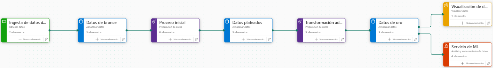
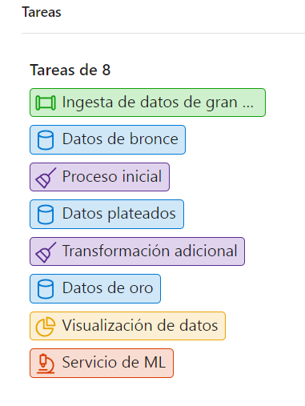
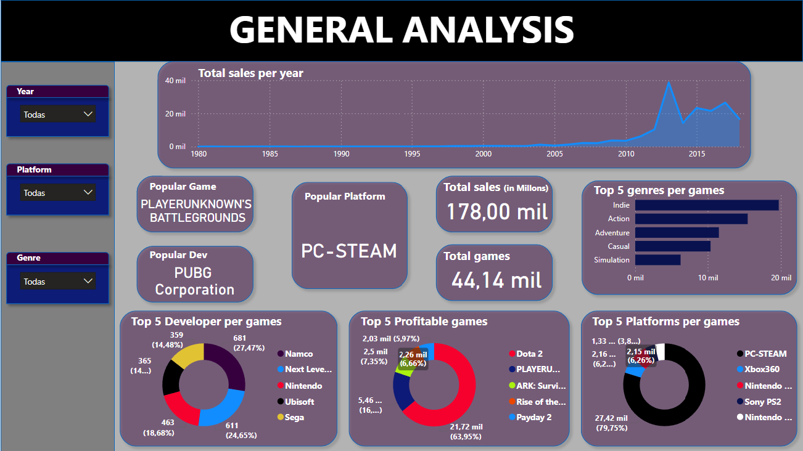

# c20-62-ft-data-bi

  

Repositorio de BI de datos del grupo 62: Proyecto de análisis de datos con Microsoft Fabric (Azure Data Stack)

## Resumen 📝
Este proyecto tiene como objetivo desarrollar un marco integral que aborde los aspectos clave de la ingeniería de datos, análisis de datos, visualización y desarrollo de modelos de machine learning dentro de la comunidad de Steam, utilizando Microsoft Fabric (Azure Data Stack). El marco está diseñado para optimizar la recolección, procesamiento y análisis de datos relacionados con el comportamiento de los usuarios, tendencias de juegos e interacciones dentro de la comunidad de Steam. Además, incluye un análisis comparativo de los datos de videojuegos en otras plataformas populares como Nintendo y PlayStation. Los conocimientos obtenidos de este análisis proporcionarán un valioso soporte para la toma de decisiones estratégicas, incluyendo el desarrollo de nuevos juegos, la optimización de estrategias de marketing y la mejora de la experiencia del usuario en la plataforma.

## Estructura del Proyecto

| Carpeta/Archivo          | Descripción                                                                              |
| ------------------------ | ---------------------------------------------------------------------------------------- |
| **/data**                | Carpeta que almacena los conjuntos de datos y archivos utilizados por el análisis, dashboard y modelos de ML. |
| **/Notebooks**           | Carpeta que contiene los notebooks de Jupyter utilizados para los procesos de ETL, EDA y creación de características. |
| **/Images**              | Carpeta con imágenes relevantes e ilustrativas para el proyecto de análisis.             |
| **requirements.txt**     | Archivo que enumera las dependencias y bibliotecas necesarias para ejecutar el proyecto. |
| **gitignore**            | Archivo que especifica carpetas y archivos que deben ser ignorados por el control de versiones (git). |
| **LICENSE**              | Archivo de licencia MIT que especifica los términos bajo los cuales se comparte el código fuente. |
| **functions.py**         | Archivo Python con las funciones para desplegar en el archivo principal 'app.py'.        |
| **app.py**               | Archivo Python principal que sirve como punto de entrada para la aplicación, definiendo la configuración y ejecución del modelo. |
| **README.md**            | Documentación principal del proyecto en inglés.                                          |
| **README_ESP.md**        | Documentación principal del proyecto en español.                                         |

## Autores

  

| Nombre                   | Rol                                       | |                |
| ------------------------ | ----------------------------------------- | -------------------------------- |--------------------------------|
| **Leonardo Cortés**      | Project Manager (PM), Data Engineer, Data Analyst   |[leocortes85](https://github.com/leocortes85/)  |[Leonardo Cortés Zambrano](https://www.linkedin.com/in/leonardo-cort%C3%A9s-zambrano/)|
| **Beverly Gonzalez**     | ML Engineer y Data Scientist              |[licette32](https://github.com/licette32/) |[Beverly Gonzalez](https://www.linkedin.com/in/beverly-j-l-gonzalez-c/)|

## Características Clave

1. **Stack Tecnológico:**
   - Se utilizó **Microsoft Fabric**, que incluye todo el **Azure Data Stack**, para desarrollar una solución completa de datos de principio a fin.

2. **Arquitectura de Datos:**
   - Se implementó una **Arquitectura Medallion** para optimizar el acceso a los datos y mantener un flujo de trabajo constante, asegurando que los datos sean accesibles, manejables y estén listos para procesos posteriores.

   

  
   

   

  
   

3. **Transformaciones de Datos:**
   - Se realizaron operaciones de **Extracción, Transformación y Carga (ETL)** utilizando la librería **Pandas**, automatizando la carga de datos desde carpetas proporcionadas por el cliente.
   - Se aplicaron estrategias para manejar estructuras de datos anidadas y se eliminaron columnas irrelevantes o con alta cantidad de valores nulos para optimizar el uso de los datos.
   - Se llevó a cabo una **carga incremental** de información utilizando APIs externas, web scraping y funciones personalizadas para complementar el conjunto de datos.

4. **Ingeniería de Características:**
   - Se realizó una extensa **ingeniería de características** para garantizar que los datos estuvieran completamente consumibles, limpios y preparados para los procesos de machine learning y análisis de datos.

5. **Estructura Dimensional y Modelo Semántico:**
   - Se construyó una **estructura dimensional** almacenada en un **modelo semántico** para permitir un análisis profundo.
   - Se desarrolló un **dashboard en Power BI** que proporciona análisis visuales e insights sobre el mercado de videojuegos.

   

  
   

6. **Modelos de Recomendación:**
   - Se desarrollaron **modelos de recomendación** utilizando técnicas de **machine learning**, aprovechando específicamente la **similitud del coseno** para recomendaciones de usuarios e ítems.

7. **Pruebas y Despliegue de Modelos:**
   - Se realizaron pruebas de los modelos de machine learning utilizando las herramientas de **Azure ML**.
   - Se creó un archivo `functions.py` que almacena todas las funciones que se ejecutarán durante la fase de despliegue.

8. **Despliegue en Streamlit:**
   - Se desplegó todo el proyecto mediante **Streamlit** a través del archivo `app.py`, permitiendo a los usuarios:
     - Ver el **dashboard interactivo**.
     - Interactuar con los **modelos de machine learning**, incluyendo recomendaciones de ítems y usuarios, mostrando las capacidades completas del proyecto.
